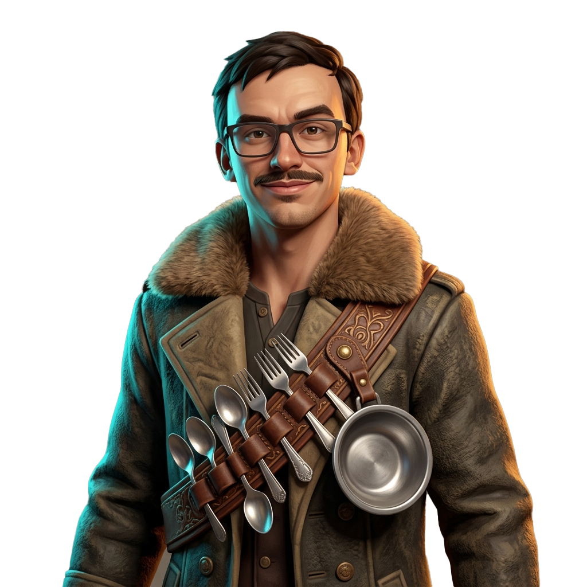

# Diplomacy Foreground / Static Model

## 1. Overview & Role in Civilization VI

In Civilization VI, custom leaders without fully rigged 3D models utilize a **2D Diplomacy Static Model** (also known as the **Fallback Leader**). This 2D portrait serves as the primary character visual in the diplomacy room during diplomatic encounters, negotiations, and war declarations, composited directly over the 1920x1080 diplomacy background.

- **Target Resolution:** `2048 x 2048 px`
- **Format:** 32-bit RGBA (DirectDraw Surface `.dds` with alpha channel)
- **Framing:** Medium three-quarters / waist-up shot, centered with adequate clearance for diplomacy UI text and interaction buttons at the bottom.
- **Production Asset (Transparent Background):** [`diplomacy-static-model.png`](diplomacy-static-model.png)
- **Raw Generated Source:** [`diplomacy-static-model-generated.jpg`](diplomacy-static-model-generated.jpg)

---

## 2. Generation Plan & Art Style Framework

The asset was engineered to seamlessly match Firaxis's official Civilization VI leader visual style while translating the mod's gameplay lore from [`README.md`](../../README.md) and preserving the real-world likeness from reference photographs.

### Lore & Thematic Foundation

- **Leader Ability: Kleptomania** — Flatware kleptomania is reflected in the character's attire and accessories, featuring stolen silverware (spoons, forks) incorporated into the outfit.
- **Civilization Ability: Soupmeister & Soup Kitchen** — As the founder of the Soup Kitchen network and master of the _Make Egg Drop Soup_ national project, Max carries a personal metal soup bowl alongside his silverware arsenal.
- **Archetype:** **The Streetwise Sovereign (The Soup Kitchen Kingpin)** — An intrepid, charismatic street-emperor commanding the Naked Homeless Man legions from the Dylan neighborhood to the grandest capitals.

### Firaxis Art Style Pillars

1. **Stylized 3D Painterly Realism:** Digital portraiture rendered over clean 3D volumes rather than photorealistic photography or flat 2D anime. Forms have tactile weight with painterly surface brushwork.
2. **Caricatured Proportions:** Subtly exaggerated personality traits, expressive eyes, and a confident roguish demeanor while maintaining presidential/monarchical presence.
3. **Theatrical 3-Point Lighting:**
   - **Key Light:** Warm amber frontal/side illumination defining facial structure.
   - **Fill Light:** Soft ambient fill preserving shadow details.
   - **Rim / Kick Light (Crucial):** Dramatic cyan and golden edge lighting tracing the shoulders, fur collar, and silhouette against the background.
4. **Material Definition:** Rich contrast between the rough leather of the trench coat, plush shearling collar, polished stainless steel cutlery, and dull metal soup bowl.

### Likeness Preservation

- Retained subject's distinctive dark rectangular eyeglasses, short dark side-parted hair, thin mustache, and friendly yet mischievous smile.

---

## 3. Generated Asset Details


_(Generated source with studio background: [`diplomacy-static-model-generated.jpg`](diplomacy-static-model-generated.jpg))_

- **Concept Name:** Option 4: The Streetwise Sovereign (The Soup Kitchen Kingpin)
- **Visual Breakdown:**
  - **Attire:** Distressed brown leather trench coat with an expansive shearling fur collar worn over a dark henley shirt.
  - **Props:** Heavy engraved leather bandolier strapped diagonally across the chest holding vintage silver forks, spoons, and an attached stainless steel soup bowl.
  - **Pose & Expression:** Upright, charismatic pose with an engaging roguish half-smile, looking directly at the diplomatic envoy.
  - **Lighting:** High-contrast studio lighting featuring vibrant cyan edge lighting along the coat edges and warm amber key lighting across the face.
  - **Background:** Transparent alpha channel isolated for direct in-game compositing.

### Exact Generation Prompt

```text
Stylized 3D Civilization VI leader portrait of the person in the reference image with rectangular glasses, short dark hair, and mustache. He is depicted as a charismatic street-emperor and Soup Kitchen kingpin wearing an eclectic textured trench coat with a warm fur collar and a leather bandolier holding shiny vintage silver spoons, forks, and a small metal soup bowl. Confident, intrepid posture with an engaging, roguish half-smile. Firaxis 3D painted art style, dramatic cyan and warm amber rim lighting highlighting his silhouette, solid neutral studio background, waist-up framing.
```

### Negative Prompt

```text
photorealistic photograph, raw camera photo, skin blemishes, 2D flat anime, cel-shaded, comic book line art, messy brushwork, duplicate limbs, mutated hands, deformed fingers, extra cutlery, cluttered complex background, low resolution, blurry, watermark, signature
```

---

## 4. Technical Next Steps (Integration Pipeline)

To integrate this asset into the Civ VI mod project (`MaxLeader`), follow these sequential steps:

### Step 1: Background Removal & Alpha Masking _(Completed)_

- **Status:** Complete. The background has been removed and isolated into [`diplomacy-static-model.png`](diplomacy-static-model.png) with a transparent alpha channel at 2048x2048 resolution.

### Step 2: Texture Conversion to DDS

1. Convert `diplomacy-static-model.png` into DirectDraw Surface (`.dds`) format using NVIDIA Texture Tools, Intel Texture Works, or GIMP/Photoshop DDS plugins.
2. **Compression Format:** `BC3 / DXT5` (Explicit Alpha) or `PF_R8G8B8A8_UNORM`.
3. **Mipmaps:** Generate complete mipmap chain.
4. Save file to:

   ```
   MaxLeader/Textures/FALLBACK_NEUTRAL_MAX.dds
   ```

### Step 3: Create Texture Instance Metadata (`.tex`)

Create `MaxLeader/Textures/FALLBACK_NEUTRAL_MAX.tex` based on Firaxis standards:

```xml
<?xml version="1.0" encoding="UTF-8" ?>
<AssetObjects::TextureInstance>
 <m_ExportSettings>
  <ePixelformat>PF_R8G8B8A8_UNORM</ePixelformat>
  <eFilterType>FT_BOX</eFilterType>
  <bUseMips>true</bUseMips>
  <iNumManualMips>0</iNumManualMips>
  <bCompleteMipChain>false</bCompleteMipChain>
  <fValueClampMin>0.000000</fValueClampMin>
  <fValueClampMax>1.000000</fValueClampMax>
  <fSupportScale>1.000000</fSupportScale>
  <fGammaIn>2.200000</fGammaIn>
  <fGammaOut>2.200000</fGammaOut>
  <iSlabWidth>0</iSlabWidth>
  <iSlabHeight>0</iSlabHeight>
  <iColorKeyX>64</iColorKeyX>
  <iColorKeyY>64</iColorKeyY>
  <iColorKeyZ>64</iColorKeyZ>
  <eExportMode>TEXTURE_2D</eExportMode>
  <bSampleFromTopLayer>false</bSampleFromTopLayer>
 </m_ExportSettings>
 <m_CookParams>
  <m_Values/>
 </m_CookParams>
 <m_Version>
  <major>4</major>
  <minor>0</minor>
  <build>253</build>
  <revision>293</revision>
 </m_Version>
 <m_Height>2048</m_Height>
 <m_Width>2048</m_Width>
 <m_Depth>1</m_Depth>
 <m_NumMipMaps>11</m_NumMipMaps>
 <m_SourceFilePath text="FALLBACK_NEUTRAL_MAX.dds"/>
 <m_SourceObjectName text=""/>
 <m_ImportedTime>0</m_ImportedTime>
 <m_ExportedTime>0</m_ExportedTime>
 <m_ClassName text="Leader_Fallback"/>
 <m_DataFiles>
  <Element>
   <m_ID text="DDS"/>
   <m_RelativePath text="FALLBACK_NEUTRAL_MAX.dds"/>
  </Element>
 </m_DataFiles>
 <m_Name text="FALLBACK_NEUTRAL_MAX"/>
 <m_Description text="Diplomacy Static Model for Leader Max"/>
 <m_Tags>
  <Element text="Leader_Fallback"/>
  <Element text="Leader"/>
  <Element text="Fallback"/>
 </m_Tags>
 <m_Groups/>
</AssetObjects::TextureInstance>
```

### Step 4: Register in Package List (`LeaderFallbacks.xlp`)

Update [`MaxLeader/XLPs/LeaderFallbacks.xlp`](../../MaxLeader/XLPs/LeaderFallbacks.xlp) to register the texture:

```xml
<Element>
   <m_EntryID text="FALLBACK_NEUTRAL_MAX"/>
   <m_ObjectName text="FALLBACK_NEUTRAL_MAX"/>
</Element>
```

### Step 5: Wire into ArtDef (`FallbackLeaders.artdef`)

Update [`MaxLeader/ArtDefs/FallbackLeaders.artdef`](../../MaxLeader/ArtDefs/FallbackLeaders.artdef):

- Replace `LEADER_JASPER_KITTY` with `LEADER_MAX`.
- Update entry to point to `FALLBACK_NEUTRAL_MAX` under `m_BLPPackage text="LeaderFallbacks"`.

### Step 6: Visual Studio / ModBuddy Project Compilation

- Verify that `FALLBACK_NEUTRAL_MAX.dds` and `FALLBACK_NEUTRAL_MAX.tex` are referenced inside `MaxLeader.civ6proj`.
- Build the mod in ModBuddy / Civ VI SDK to compile the `.blp` binary library package.
