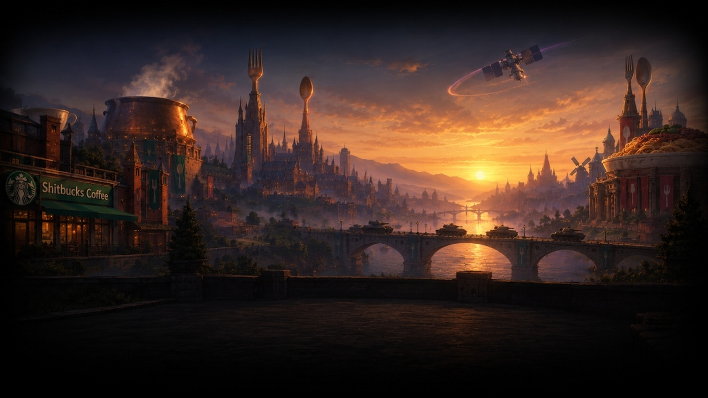
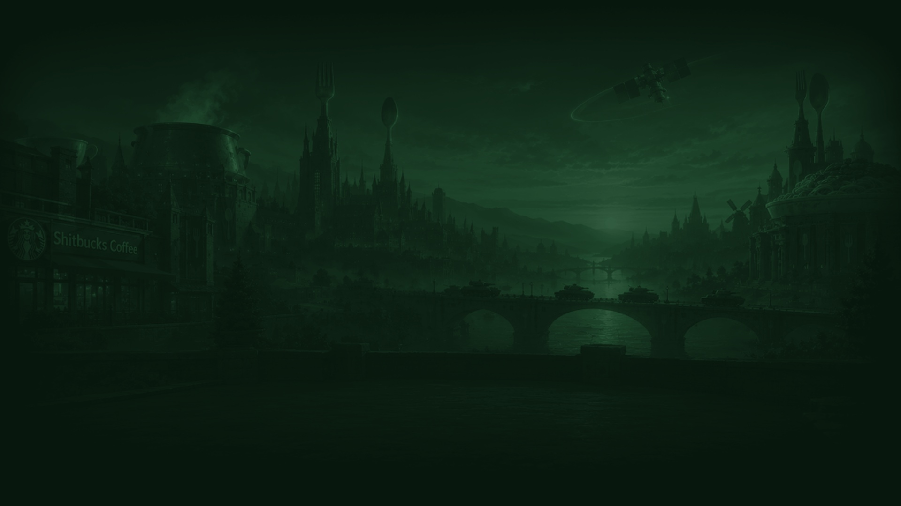

# Dawn of Man Background

## 1. Overview & Role in Civilization VI

The **Dawn of Man (DOM) Background** provides the primary environmental artwork during the initial game loading sequence and introductory speech screen in Civilization VI. It sits behind the leader's introductory lore parchment (the speech card on the left ~45% of the screen) and beneath the transparent leader portrait cutout ([`dom-leader-portrait.png`](dom-leader-portrait.md) on the right third).

- **Native Resolution:** `1920 x 1080 px` (Exact 16:9 widescreen)
- **Format:** 24-bit RGB (DirectDraw Surface `.dds`, `BC1 / DXT1` without alpha or `PF_B8G8R8A8_UNORM`)
- **Assets Provided:**
  - **Full-Color Panoramic (Game Start Speech Screen):** [`dom-background.jpg`](dom-background.jpg)
  - **Muted Dark Green Wash (Loading / Setup Screen):** [`dom-background-loading.jpg`](dom-background-loading.jpg)

---

## 2. Selected Asset Breakdown

### Variant A: Full-Color Panoramic (Speech Screen)



- **File:** [`dom-background.jpg`](dom-background.jpg) (`1920 x 1080 px`)
- **Visual Breakdown & Lore Synergy:**
  - **Left Foreground (Shitbucks Coffee):** A warmly lit corner cafe with the signature green circular emblem and awning, symbolizing the movement buff granted to passing troops.
  - **Left Midground (Soupmeister Cauldron):** A gigantic, glowing copper cauldron steaming continuously above fortress walls, honoring the _Make Egg Drop Soup_ national project.
  - **Center Architecture (Kleptomania Silverware Sp冏res):** Soaring gothic towers topped with monumental golden fork and spoon sculptures rising into the clouds.
  - **Center River Viaduct (Tank Patrols):** An arched stone bridge spanning a gleaming river at dawn, carrying an armored convoy of military tanks on patrol.
  - **Sky & Atmosphere (Nuclear Satellite):** In the twilight/dawn sky, an advanced nuclear surveillance satellite glints in orbit, casting a luminous orbital arc.
  - **Right Palace (Culinary Monument):** A grand classical rotunda crowned with a colossal bowl of food and towering cutlery finials.
  - **Foreground Terrace (UI Contrast):** A shadowed stone balustrade in the lower foreground, naturally darkening the bottom third to provide clean contrast for UI text and speech elements.

---

### Variant B: Muted Dark Green Wash (Loading / Setup Screen)



- **File:** [`dom-background-loading.jpg`](dom-background-loading.jpg) (`1920 x 1080 px`)
- **Purpose:** Civilization VI loading and setup screens utilize a single-color tonal wash to eliminate visual distraction behind loading progress bars, tooltips, and system notifications.
- **Treatment:**
  - Desaturated duotone dark spruce/forest green palette (`#08160d` shadows, `#1e462c` midtones, `#527e60` highlights).
  - Preserves all environmental details (the satellite, tanks, bridge, cauldron, and Shitbucks) while dampening high-frequency contrast.
  - Provides a cohesive, muted backdrop that allows the foreground leader art to pop.

---

## 3. Technical Integration Pipeline

To compile these background assets into the Civilization VI mod project (`MaxLeader`):

### Step 1: Format & Resolution Verification

- Dimensions: `1920 x 1080 px`
- Aspect Ratio: Exactly `16:9` (1.7778)
- Color Depth: 24-bit RGB (no alpha channel required)

### Step 2: DDS Texture Conversion

Convert both JPG assets into `.dds` using NVIDIA Texture Tools, Intel Texture Works, or GIMP:

- **Format:** `BC1 / DXT1` (Linear, no alpha) or `PF_B8G8R8A8_UNORM`
- **Mipmaps:** Generate complete mipmap chain
- **Output Destinations:**
  - `MaxLeader/Textures/DOM_BACKGROUND_MAX.dds` (from `dom-background.jpg`)
  - `MaxLeader/Textures/LOADING_BACKGROUND_MAX.dds` (from `dom-background-loading.jpg`)

### Step 3: Create Texture Metadata (`.tex`)

Create `MaxLeader/Textures/DOM_BACKGROUND_MAX.tex`:

```xml
<?xml version="1.0" encoding="UTF-8" ?>
<AssetObjects::TextureInstance>
	<m_ExportSettings>
		<ePixelformat>PF_B8G8R8A8_UNORM</ePixelformat>
		<eFilterType>FT_BOX</eFilterType>
		<bUseMips>true</bUseMips>
		<iNumManualMips>0</iNumManualMips>
		<bCompleteMipChain>true</bCompleteMipChain>
		<eExportMode>TEXTURE_2D</eExportMode>
	</m_ExportSettings>
	<m_Height>1080</m_Height>
	<m_Width>1920</m_Width>
	<m_Depth>1</m_Depth>
	<m_NumMipMaps>11</m_NumMipMaps>
	<m_SourceFilePath text="DOM_BACKGROUND_MAX.dds"/>
	<m_SourceObjectName text=""/>
	<m_ClassName text="UserInterface"/>
	<m_DataFiles>
		<Element>
			<m_ID text="DDS"/>
			<m_RelativePath text="DOM_BACKGROUND_MAX.dds"/>
		</Element>
	</m_DataFiles>
	<m_Name text="DOM_BACKGROUND_MAX"/>
</AssetObjects::TextureInstance>
```

### Step 4: Register in XLP and Config XML

- Add entries to `MaxLeader/XLPs/UILeaders.xlp` (or `UICivilizations.xlp`).
- Wire into `MaxLeader/NewLeader_Config.xml` under `<Players>`:
  ```xml
  <Background>DOM_BACKGROUND_MAX</Background>
  ```
